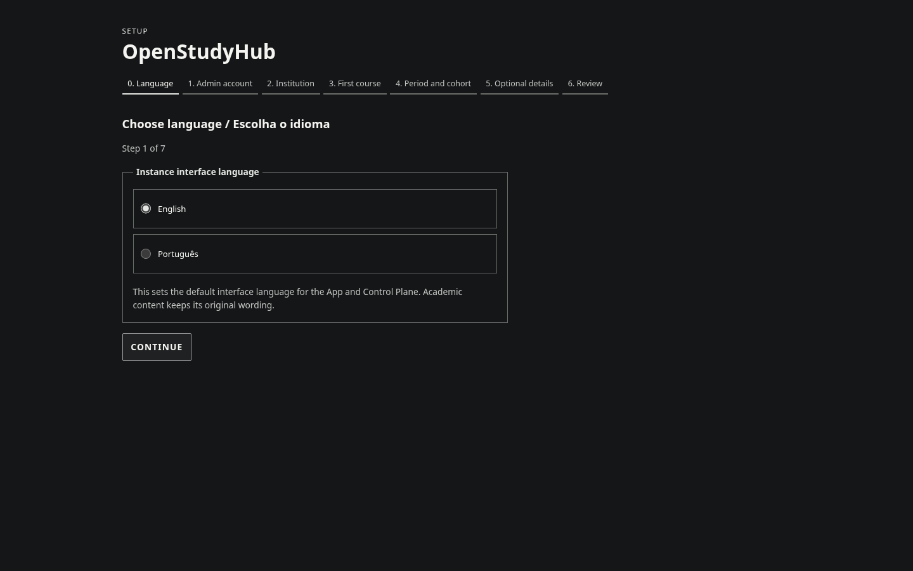
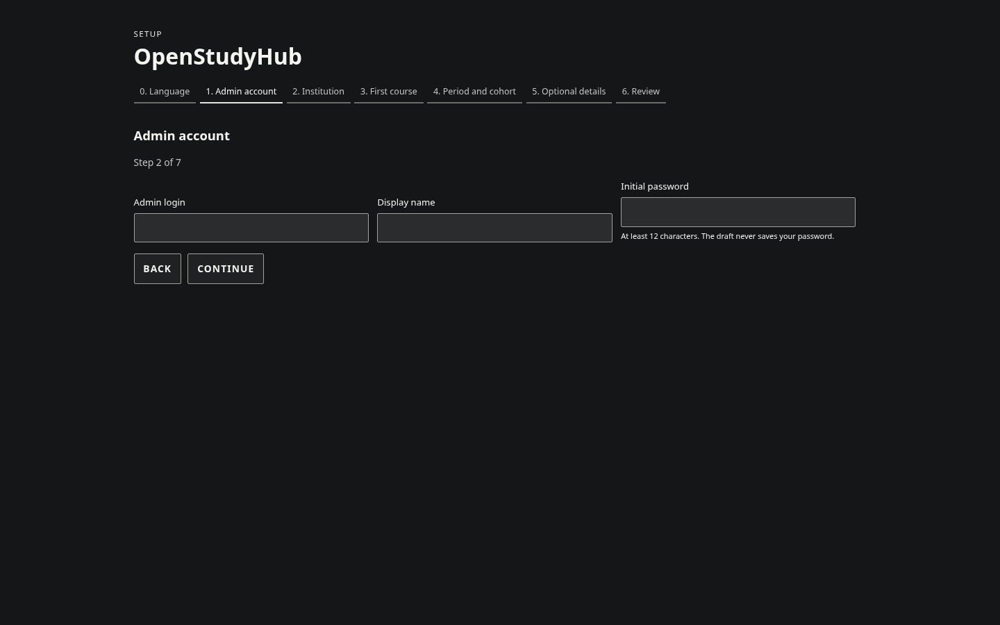
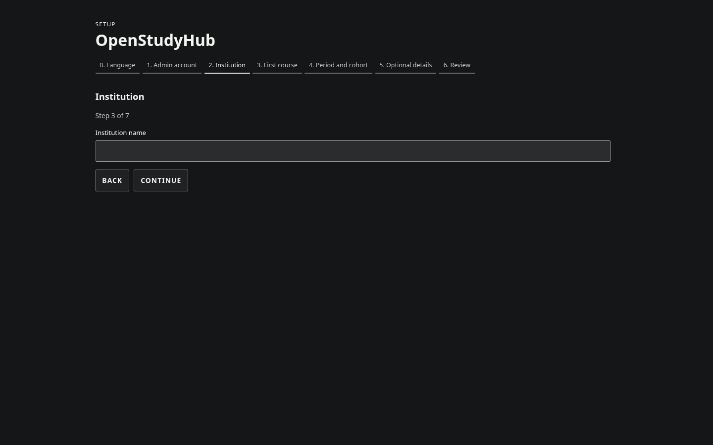
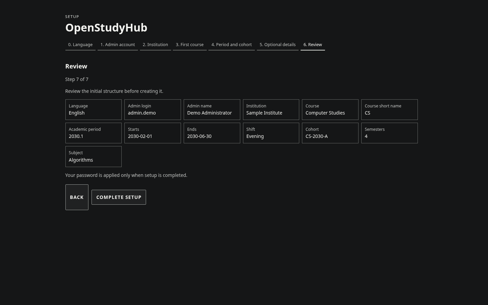

# Primeiros passos

Uma instalação nova começa no Admin: alguém define a instituição e prepara as primeiras turmas. Depois, cada pessoa entra no App para encontrar suas disciplinas e organizar o trabalho. O Google pode ser conectado mais tarde, por usuário, sem interromper esse começo.

## Desenvolvimento local

Requisitos:

- Node.js 24.x
- pnpm 10.x

```bash
cp .env.example .env
pnpm install
pnpm db:migrate
node --env-file=.env scripts/migrate-v2-production.mjs
pnpm dev
```

Antes de migrar a V2, altere `OPENSTUDYHUB_V2_DATABASE_PATH` no `.env` para um caminho absoluto gravável, separado de `DATABASE_PATH`. Abra `http://localhost:3000` para o App. Para produção, use o Compose que separa App e Admin; veja [Deploy](deployment.md).

Em um banco V2 vazio, abra o Admin em `/control/setup`. Escolha primeiro o idioma padrão da instância (English vem selecionado), crie o administrador, informe instituição, curso, período e turma, revise e conclua. Não reutilize senha institucional.

## Setup inicial recomendado

1. No setup do Admin, escolha idioma, crie a conta administrativa e defina instituição, curso, período e turma inicial.
2. Após entrar no Control Plane, cadastre as disciplinas e Offerings necessárias.
3. Matricule usuários nas Offerings corretas.
4. Configure Google somente se quiser Classroom/Drive/Docs.
5. Configure grupos e chats conforme a necessidade.

### Como aparecem as etapas iniciais

As imagens abaixo foram capturadas da V2 com uma instituição e conta fictícias. Nenhuma senha ou integração Google aparece nelas.









Uma Subject é a definição da disciplina. Uma Subject Offering representa a ocorrência concreta para programa/período/turma/professor/Classroom. Não junte duas turmas diferentes apenas porque o nome da disciplina coincide.

## Checks de desenvolvimento

```bash
pnpm format:check
pnpm lint
pnpm typecheck
pnpm test
pnpm build
```

## Dados locais

Por padrão:

- banco principal: `./data/openstudyhub.db`;
- banco V2: caminho absoluto definido em `OPENSTUDYHUB_V2_DATABASE_PATH`;
- assets privados: `./data/private-assets`

`data/`, `.env`, bancos, tokens e uploads não devem ser versionados.
