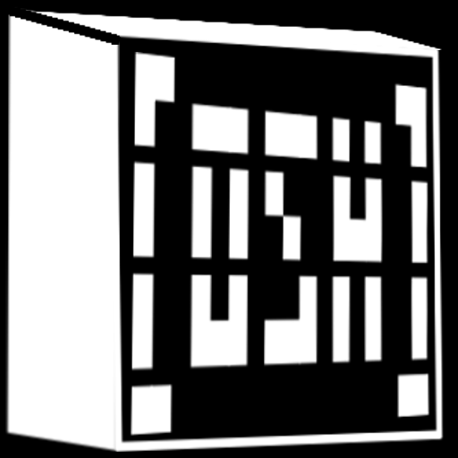

<section class="osh-hero">
  
  

    
SELF-HOSTED · OPEN SOURCE · ACADÊMICO

    <h1>OpenStudyHub</h1>
    

      Um workspace acadêmico para reunir disciplinas, agenda, Classroom,
      Drive, notas, documentos e colaboração sem transformar seus estudos
      em mais uma plataforma fechada.
    

    

      <a href="instalacao-do-zero/" class="osh-primary">Começar do zero</a>
      <a href="deployment/" class="osh-secondary">Deploy</a>
      <a href="google/" class="osh-secondary">Integração Google</a>
    

  

</section>

  <section>
    <h2>Acadêmico primeiro</h2>
    

      Programas, turmas, períodos, disciplinas, Subject Offerings e matrículas
      são modelados separadamente para que alunos do mesmo curso possam ter
      matérias e Classrooms diferentes.
    

  </section>
  <section>
    <h2>Google opcional</h2>
    

      O Core funciona sem Google. Quando configurado, cada usuário conecta sua
      própria conta para Classroom e a instância pode escolher uma conta central
      para Drive e Google Docs.
    

  </section>
  <section>
    <h2>Colaboração explícita</h2>
    

      Groups, Chat, Notes e Documents usam autorização server-side. Conteúdo
      privado continua privado até ser compartilhado de forma explícita.
    

  </section>
  <section>
    <h2>Seus arquivos continuam seus</h2>
    

      SQLite guarda relações e metadados; Drive/Docs e exportações portáveis
      evitam prender o estudo a um formato proprietário do OpenStudyHub.
    

  </section>

## O que existe na V1

- Home personalizável, busca, atalhos e temas claro/escuro.
- Hoje, agenda, atividades e disciplinas.
- Google Classroom read-only por usuário.
- Drive acadêmico central opcional.
- Google Docs a partir de modelos e importação DOCX.
- Notes privadas e Notes de disciplina compartilháveis.
- Documents e Groups.
- Chat direto, de Group e por audiência acadêmica.
- Perfis, Visual Tags e notificações enquanto o Hub está aberto.
- Projects versionados, com opção administrativa para ocultar o recurso.
- Docker/Compose para self-hosting.

## Transparência sobre IA

O projeto foi desenvolvido com uso extensivo de ferramentas de IA para
implementação, testes, depuração e documentação. Direção de produto, requisitos,
decisões arquiteturais e validação são conduzidos pelo mantenedor.

Leia também: [Como IA foi usada no desenvolvimento](ai-usage.md).

## Próximos passos

Se você está instalando pela primeira vez, siga
[Instalação do zero](instalacao-do-zero.md). Se a instalação já existe, use o
[Guia do administrador](deployment/ADMIN_GUIDE.md).
