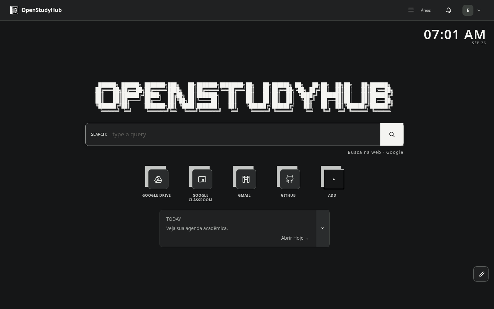
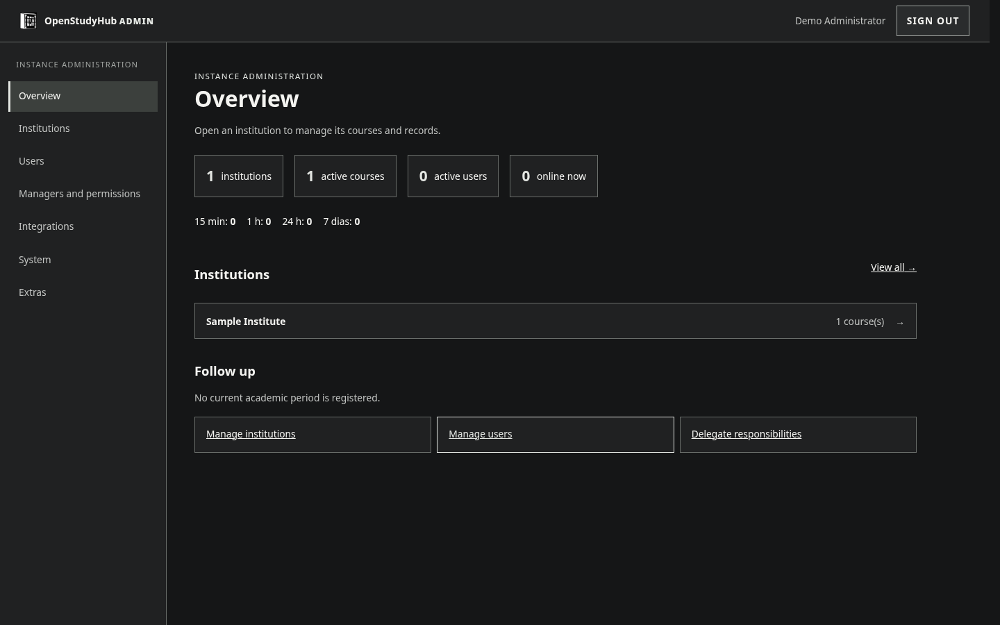

  <header class="osh-landing-bar">
    &gt; OPENSTUDYHUB <small>/ V2</small>
    

      <button type="button" data-lang="pt" aria-pressed="true">PT</button>
      <button type="button" data-lang="en" aria-pressed="false">EN</button>
    

  </header>

  <section class="osh-landing-hero" aria-labelledby="osh-title">
    

      
[ SUA VIDA ACADÊMICA, EM UM LUGAR ]

      
[ YOUR ACADEMIC SPACE, IN ONE PLACE ]

      <pre class="osh-title-ascii osh-title-ascii--desktop" aria-hidden="true">   ___                   ____  _             _       _   _       _
  / _ \ _ __   ___ _ __ / ___|| |_ _   _  __| |_   _| | | |_   _| |__
 | | | | '_ \ / _ \ '_ \\___ \| __| | | |/ _` | | | | |_| | | | | '_ \
 | |_| | |_) |  __/ | | |___) | |_| |_| | (_| | |_| |  _  | |_| | |_) |
  \___/| .__/ \___|_| |_|____/ \__|\__,_|\__,_|\__, |_| |_|\__,_|_.__/
       |_|                                     |___/</pre>
      <pre class="osh-title-ascii osh-title-ascii--mobile" aria-hidden="true">   ___  ____  _   _
  / _ \/ ___|| | | |
 | | | \___ \| |_| |
 | |_| |___) |  _  |
  \___/|____/|_| |_|</pre>
      OPENSTUDYHUB / V2
      <h1 id="osh-title" class="osh-visually-hidden">OpenStudyHub</h1>
      
Abra o dia e encontre suas aulas, atividades e arquivos sem procurar em vários lugares.

      
Open your day and find classes, coursework and files without hunting through different places.

      
O OpenStudyHub roda na sua própria instalação. Você decide se quer conectar Google Classroom e Drive; o espaço de estudo e a colaboração continuam disponíveis sem eles.

      
OpenStudyHub runs on your own installation. Connect Google Classroom and Drive if you want; the study space and collaboration work without them.

      
<a class="osh-action-primary" href="instalacao-do-zero/">Começar instalação ↗</a><a href="deployment/">Ver arquitetura</a><a href="https://github.com/RichardSpinola/OpenStudyHub">Código no GitHub</a>

      
<a class="osh-action-primary" href="en/">Read the English guide ↗</a><a href="https://github.com/RichardSpinola/OpenStudyHub">Source on GitHub</a>

    

    

OSH://WORKSPACE● ● ●

OPEN STUDY HUB

01 ACADEMIC CONTEXT <b>READY</b>

02 YOUR MATERIALS <b>LOCAL</b>

03 COLLABORATION <b>LIVE</b>

INSTANCE CONTROLLED BY YOU ▪ AGPL-3.0

  </section>

  
APP + CONTROL PLANECLASSROOM READ ONLYOPTIONAL DRIVEOPEN SOURCE

  <section class="osh-landing-section" aria-labelledby="osh-academic-title">
01 / ACADEMIC

<h2 id="osh-academic-title" data-copy="pt">O contexto vem primeiro.</h2><h2 data-copy="en">Academic context comes first.</h2>
Instituição, curso, turma e período organizam as disciplinas. Cada pessoa vê suas matrículas e pode associar seus próprios Classrooms antes de sincronizar atividades.

Institution, course, cohort and term organize subjects. Each person sees their own enrollments and can map their own Classrooms before syncing coursework.

DISCIPLINAS / SUBJECTSCLASSROOMATIVIDADES / COURSEWORKHOJE / TODAY

</section>

  <section class="osh-landing-section" aria-labelledby="osh-work-title">
02 / WORKSPACE

<h2 id="osh-work-title" data-copy="pt">Trabalhe junto. Guarde o que importa.</h2><h2 data-copy="en">Work together. Keep what matters.</h2>
Notes, Documents, Projects e Chat conectam o trabalho diário. Drive e Google Docs são opcionais; o Quadro Global e os minigames ficam em Extras, sob controle do Admin.

Notes, Documents, Projects and Chat connect daily work. Drive and Google Docs are optional; the Global Whiteboard and minigames live in Extras, controlled by the Admin.

NOTESDOCUMENTSPROJECTSCHATEXTRASWHITEBOARD

</section>

  <figure class="osh-landing-shot"><figcaption data-copy="pt">Home da V2 com atalhos padrão e busca.</figcaption><figcaption data-copy="en">V2 Home with default shortcuts and search.</figcaption></figure>

  <section class="osh-landing-section" aria-labelledby="osh-control-title">
03 / CONTROL

<h2 id="osh-control-title" data-copy="pt">Uma instalação. Duas superfícies.</h2><h2 data-copy="en">One installation. Two surfaces.</h2>
O App atende a comunidade. O Control Plane administra instituição, contas, permissões, integrações e backups. Em Docker, o Admin fica local ou na LAN por padrão. Personalize aparência e atalhos sem perder a identidade do espaço.

The App serves your community. The Control Plane manages the institution, accounts, permissions, integrations and backups. With Docker, Admin stays local or on the LAN by default. Customize appearance and shortcuts without losing the workspace identity.

<a href="deployment/">Instalar com Docker →</a><a href="google/">Configurar Google →</a><a href="extension/">Nova Aba →</a>

<a href="en/">Installation and operations →</a><a href="extension/">New Tab extension →</a>

</section>

  <figure class="osh-landing-shot"><figcaption data-copy="pt">Control Plane em uma instalação fictícia.</figcaption><figcaption data-copy="en">Control Plane in a fictional installation.</figcaption></figure>

  <footer class="osh-landing-footer">OPENSTUDYHUB / V2Código aberto sob <a href="LICENSING/">AGPL-3.0</a>. Integrações Google opcionais.Open source under <a href="LICENSING/">AGPL-3.0</a>. Google integrations are optional.<a href="https://github.com/RichardSpinola/OpenStudyHub">GITHUB ↗</a></footer>

